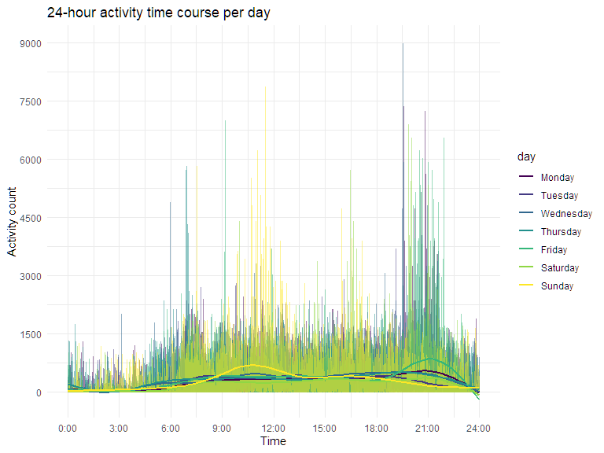
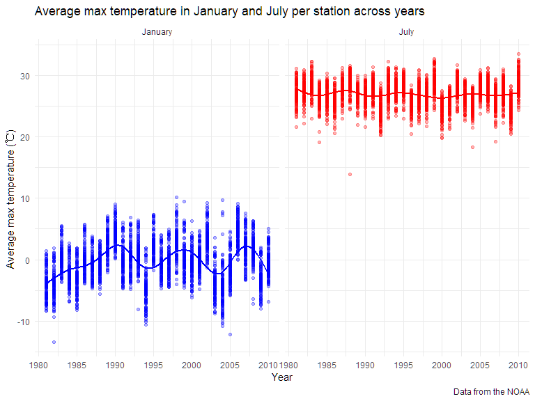
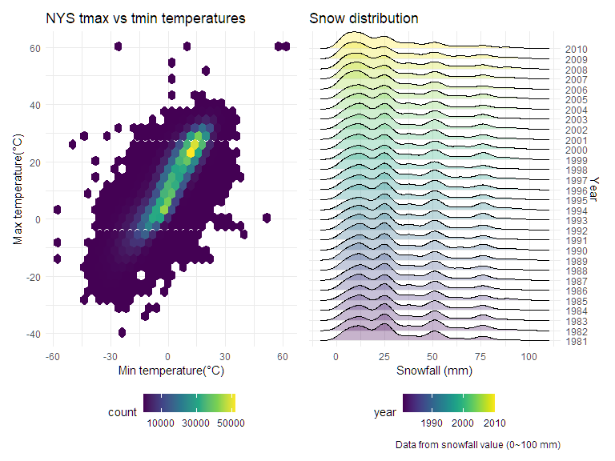

Homework 3
================
Tongtong Zhu
2022-10-13

## Problem 1

### Load and read `instacart` data

``` r
data("instacart")

instacart = 
  instacart %>% 
  as_tibble(instacart)
```

**Description of data**

The `instacart` is a online grocery shopping dataset in 2017. It
contains 1384617 observations and 15 variables. The key variables
include order_id, product_id, add_to_cart_order, reordered, user_id,
eval_set, order_number, order_dow, order_hour_of_day,
days_since_prior_order, product_name, aisle_id, department_id, aisle,
department.

### Comment on the results

#### Aisle count and identify

``` r
instacart %>% 
  group_by(aisle_id, aisle) %>% 
  summarize(n_obs = n()) %>% 
  arrange(desc(n_obs))
```

    ## # A tibble: 134 × 3
    ## # Groups:   aisle_id [134]
    ##    aisle_id aisle                          n_obs
    ##       <int> <chr>                          <int>
    ##  1       83 fresh vegetables              150609
    ##  2       24 fresh fruits                  150473
    ##  3      123 packaged vegetables fruits     78493
    ##  4      120 yogurt                         55240
    ##  5       21 packaged cheese                41699
    ##  6      115 water seltzer sparkling water  36617
    ##  7       84 milk                           32644
    ##  8      107 chips pretzels                 31269
    ##  9       91 soy lactosefree                26240
    ## 10      112 bread                          23635
    ## # … with 124 more rows

There are 134 aisles and `fresh vegetables`, `fresh fruits` and
`packaged vegetables fruits` are the first, second and third aisles with
the most items ordered from, respectively.

#### Plot aisles

``` r
instacart %>% 
  group_by(aisle) %>% 
  summarize(n_obs = n()) %>% 
  filter(n_obs > 10000) %>% 
  mutate(aisle = forcats::fct_reorder(aisle, n_obs)) %>% 
  ggplot(aes(x = n_obs, y = aisle)) +
  geom_col() +
  labs(
    title = "Number of items ordered per aisle",
    x = "Number of items",
    y = "Aisle name",
    caption = "Note: Limited to aisles with more than 10000 items ordered"
  )
```


#### Table three aisles with three most popular items

``` r
instacart %>% 
  filter(aisle == "baking ingredients" |
         aisle == "dog food care" |
         aisle == "packaged vegetables fruits") %>% 
  group_by(aisle, product_name) %>% 
  summarize(n_pop = n()) %>% 
  mutate(rank = min_rank(desc(n_pop))) %>% 
  filter(rank < 4) %>% 
  arrange(desc(n_pop)) %>% 
  knitr::kable()
```

| aisle                      | product_name                                  | n_pop | rank |
|:---------------------------|:----------------------------------------------|------:|-----:|
| packaged vegetables fruits | Organic Baby Spinach                          |  9784 |    1 |
| packaged vegetables fruits | Organic Raspberries                           |  5546 |    2 |
| packaged vegetables fruits | Organic Blueberries                           |  4966 |    3 |
| baking ingredients         | Light Brown Sugar                             |   499 |    1 |
| baking ingredients         | Pure Baking Soda                              |   387 |    2 |
| baking ingredients         | Cane Sugar                                    |   336 |    3 |
| dog food care              | Snack Sticks Chicken & Rice Recipe Dog Treats |    30 |    1 |
| dog food care              | Organix Chicken & Brown Rice Recipe           |    28 |    2 |
| dog food care              | Small Dog Biscuits                            |    26 |    3 |

In `baking ingredients` aisle, the three most popular items are
`Light Brown Sugar`, `Pure Baking Soda` and `Cane Sugar`. In
`dog food care` aisle, the three most popular items are
`Snack Sticks Chicketn & Rice Recipe Dog Treats` and
`Small Dog Biscuits`. In `packaged vegetables fruits` aisle, the three
most popular items are `Organic Baby Spinach`, `Organic Raspberries` and
`Organic Blueberries`.

#### Table mean hour

``` r
instacart %>% 
  filter(product_name == "Pink Lady Apples" | product_name == "Coffee Ice Cream") %>% 
  group_by(product_name, order_dow) %>% 
  summarize(mean = mean(order_hour_of_day)) %>% 
  pivot_wider(
    names_from = order_dow,
    values_from = mean
  ) %>% 
  rename(
    "Sun" = "0",
    "Mon" = "1",
    "Tue" = "2",
    "Wen" = "3",
    "Thur" = "4",
    "Fri" = "5",
    "Sat" = "6" ) %>% 
  knitr::kable(digits = 2)
```

| product_name     |   Sun |   Mon |   Tue |   Wen |  Thur |   Fri |   Sat |
|:-----------------|------:|------:|------:|------:|------:|------:|------:|
| Coffee Ice Cream | 13.77 | 14.32 | 15.38 | 15.32 | 15.22 | 12.26 | 13.83 |
| Pink Lady Apples | 13.44 | 11.36 | 11.70 | 14.25 | 11.55 | 12.78 | 11.94 |

In general, `Pink Lady Apples` is ordered earlier than
`Coffee Ice Cream`.

## Problem 2

### Load, tidy and wrangle data

``` r
accel_df = 
  read_csv("./data/accel_data.csv") %>% 
  janitor::clean_names() %>% 
  pivot_longer(
    activity_1:activity_1440,
    names_to = "minute",
    names_prefix = "activity_",
    values_to = "count"
  ) %>% 
  mutate(
    weekday_vs_weekend = ifelse(day %in% c("Saturday","Sunday"),"weekend","weekday"),
    minute = as.numeric(minute),
    day = factor(day),
    day = forcats::fct_relevel(day, c("Monday", "Tuesday", "Wednesday", "Thursday", "Friday", "Saturday", "Sunday"))
  ) %>% 
  select(week, day, everything())
```

**Description**

The tidied `accel_df` dataset contains 50400 observations and 6
variables. The key variables include week, day, day_id, minute, count,
weekday_vs_weekend.

### Calculate the total activity per day and table the totals

``` r
total_act = 
  accel_df %>% 
  group_by(week, day) %>% 
  summarize(total_activity = sum(count)) 
   
knitr::kable(total_act)
```

| week | day       | total_activity |
|-----:|:----------|---------------:|
|    1 | Monday    |       78828.07 |
|    1 | Tuesday   |      307094.24 |
|    1 | Wednesday |      340115.01 |
|    1 | Thursday  |      355923.64 |
|    1 | Friday    |      480542.62 |
|    1 | Saturday  |      376254.00 |
|    1 | Sunday    |      631105.00 |
|    2 | Monday    |      295431.00 |
|    2 | Tuesday   |      423245.00 |
|    2 | Wednesday |      440962.00 |
|    2 | Thursday  |      474048.00 |
|    2 | Friday    |      568839.00 |
|    2 | Saturday  |      607175.00 |
|    2 | Sunday    |      422018.00 |
|    3 | Monday    |      685910.00 |
|    3 | Tuesday   |      381507.00 |
|    3 | Wednesday |      468869.00 |
|    3 | Thursday  |      371230.00 |
|    3 | Friday    |      467420.00 |
|    3 | Saturday  |      382928.00 |
|    3 | Sunday    |      467052.00 |
|    4 | Monday    |      409450.00 |
|    4 | Tuesday   |      319568.00 |
|    4 | Wednesday |      434460.00 |
|    4 | Thursday  |      340291.00 |
|    4 | Friday    |      154049.00 |
|    4 | Saturday  |        1440.00 |
|    4 | Sunday    |      260617.00 |
|    5 | Monday    |      389080.00 |
|    5 | Tuesday   |      367824.00 |
|    5 | Wednesday |      445366.00 |
|    5 | Thursday  |      549658.00 |
|    5 | Friday    |      620860.00 |
|    5 | Saturday  |        1440.00 |
|    5 | Sunday    |      138421.00 |

There is no apparent trends of total activity based on the table. And
there is no regular difference in total activity between weekdays and
weekends.

### Plot 24-hour activity

``` r
accel_df %>% 
  ggplot(aes(x = minute, y = count, color = day)) +
  geom_line(alpha = 0.5) +
  geom_smooth(se = FALSE) +
  labs(
    title = "24-hour activity time course per day",
    x = "Time",
    y = "Activity count") +
  scale_x_continuous(
    breaks = c(0, 180, 360, 540, 720, 900, 1080, 1260, 1440),
    labels = c("0:00", "3:00", "6:00", "9:00","12:00","15:00","18:00","21:00","24:00")
    ) +
  scale_y_continuous(
    breaks = c(0, 1500, 3000, 4500, 6000, 7500, 9000)
  ) +
  theme(legend.position = "right")
```



**Description and conclusion**

Based on this graph, 19:00-22:00 seems to be the time period with
relatively high activity for most days. The activity count is highest
around 21:00 on Friday and 12:00 on Sunday. The highest activity count
is about 9000 for all days.

## Problem 3

### Load `NY NOAA` data

``` r
data("ny_noaa")
```

### Count missing data

``` r
noaa_missing = ny_noaa %>% 
  summarize(
    prcp_missing = mean(is.na(prcp)),
    snow_missing = mean(is.na(snow)),
    snwd_missing = mean(is.na(snwd)),
    tmax_missing = mean(is.na(tmax)),
    tmin_missing = mean(is.na(tmin)))

knitr::kable(noaa_missing)
```

| prcp_missing | snow_missing | snwd_missing | tmax_missing | tmin_missing |
|-------------:|-------------:|-------------:|-------------:|-------------:|
|    0.0561958 |     0.146896 |    0.2280331 |    0.4371025 |    0.4371264 |

**Description**

The `ny_noaa` dataset provides weather data of New York State weather
stations from Jan. 1, 1981 to Dec. 31, 2010. It contains 2595176
observations and 7 variables. The key variables include id, date, prcp,
snow, snwd, tmax, tmin. There are 747 distinct weather stations in New
York State. This dataset contains extensive missing data, in which
`tmax` and `tmin` have a higher percent of missing data, almost to 44%
for each, and `snow` and `snwd` have a lower percent of missing data.

### Clean data, create variables and wrangle data

``` r
noaa_tidy = ny_noaa %>% 
  janitor::clean_names() %>% 
  separate(date, into = c("year", "month","day"), sep = "-") %>% 
  mutate(
    prcp = prcp / 10,
    tmax = as.numeric(tmax) / 10,
    tmin = as.numeric(tmin) / 10,
    year = as.numeric(year),
    month = month.name[as.numeric(month)],
    day = as.numeric(day)
    ) 
```

``` r
noaa_tidy %>% 
  count(snow) %>% 
  arrange(desc(n))
```

    ## # A tibble: 282 × 2
    ##     snow       n
    ##    <int>   <int>
    ##  1     0 2008508
    ##  2    NA  381221
    ##  3    25   31022
    ##  4    13   23095
    ##  5    51   18274
    ##  6    76   10173
    ##  7     8    9962
    ##  8     5    9748
    ##  9    38    9197
    ## 10     3    8790
    ## # … with 272 more rows

**Description**

The variables of `prcp`, `tmax` and `tmin` are divided by 10 to get
reasonable units, because their original units are tenths of standard
units. The most commonly observed values for snowfall is 0.

### Plot average tmax in January and July

``` r
noaa_tmax = noaa_tidy %>% 
  filter(month %in% c("January", "July")) %>% 
  group_by(id, year, month) %>% 
  summarize(tmax_mean = mean(tmax, na.rm = TRUE))

ggplot(noaa_tmax, aes(x = year, y = tmax_mean, color = month)) +
  geom_point(alpha = 0.3) +
  geom_smooth(alpha = 0.5, se = FALSE) +
  labs(
    title = "Average max temperature in January and July per station across years",
    x = "Year",
    y = "Average max temperature (℃) ",
    caption = "Data from the NOAA" ) +
  scale_x_continuous(
    breaks = c(1980, 1985, 1990, 1995, 2000, 2005, 2010)) +
  facet_grid(. ~ month) +
  theme(legend.position = "none") +
  scale_color_manual(values = c("blue", "red"))
```



**Description**

The average max temperature in January is within -10-10°C and it
fluctuates a bit along years, but there is no apparent trends of the
fluctuation. The average max temperature in July is within 23-30°C and
it doesn’t fluctuate significantly along years. Comparing the average
max temperature of these two months, January has a lower average max
temperature than that of July, and January fluctuates more significantly
than July. Both months have some outliers, the most outlier for January
is about -14°C and the most outlier for July is about 14°C.

### Plot tmax vs tmin

``` r
tmax_tmin = 
  ggplot(noaa_tidy, aes(x = tmin, y = tmax)) +
    geom_hex() +
    labs(
      title = "NYS tmax vs tmin temperatures",
      x = "Min temperature(°C)",
      y = "Max temperature(°C)") +
    scale_fill_continuous(
    breaks = c(10000, 30000, 50000)) +
    theme(legend.position = "bottom")
```

### Plot snowfall distribution

``` r
snow_dis =
  noaa_tidy %>% 
  filter(snow > 0, snow < 100) %>% 
  ggplot(aes(x = snow, y = factor(year), fill = year)) +
  geom_density_ridges(alpha = 0.3) +
  labs(
    title = "Snow distribution",
    x = "Snowfall (mm)",
    y = "Year",
    caption = "Data from snowfall value (0~100 mm)"
  ) +
  scale_x_continuous(
    breaks = c(0,25,50,75,100)) +
  scale_y_discrete(
    position = "right") +
  viridis::scale_fill_viridis() 
```

### Make a two-panel plot

``` r
tmax_tmin + snow_dis
```


