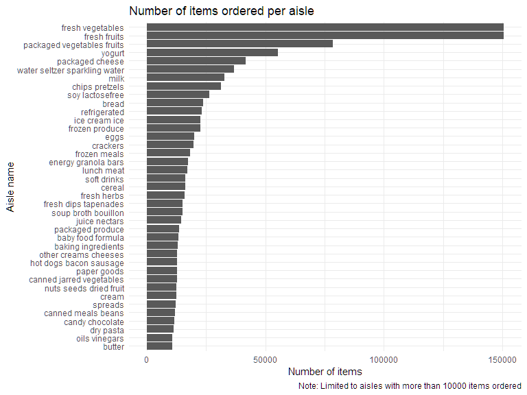

Homework 3
================
Tongtong Zhu
2022-10-13

## Problem 1

### Load and read `instacart` data

``` r
data("instacart")

instacart = 
  instacart %>% 
  as_tibble(instacart)
```

**Description of data**

The `instacart` is a online grocery shopping dataset in 2017. It
contains 1384617 observations and 15 variables. The key variables
include order_id, product_id, add_to_cart_order, reordered, user_id,
eval_set, order_number, order_dow, order_hour_of_day,
days_since_prior_order, product_name, aisle_id, department_id, aisle,
department.

### Comment on the results

#### Aisle count and identify

``` r
instacart %>% 
  group_by(aisle_id, aisle) %>% 
  summarize(n_obs = n()) %>% 
  arrange(desc(n_obs))
```

    ## # A tibble: 134 × 3
    ## # Groups:   aisle_id [134]
    ##    aisle_id aisle                          n_obs
    ##       <int> <chr>                          <int>
    ##  1       83 fresh vegetables              150609
    ##  2       24 fresh fruits                  150473
    ##  3      123 packaged vegetables fruits     78493
    ##  4      120 yogurt                         55240
    ##  5       21 packaged cheese                41699
    ##  6      115 water seltzer sparkling water  36617
    ##  7       84 milk                           32644
    ##  8      107 chips pretzels                 31269
    ##  9       91 soy lactosefree                26240
    ## 10      112 bread                          23635
    ## # … with 124 more rows

There are 134 aisles and `fresh vegetables`, `fresh fruits` and
`packaged vegetables fruits` are the first, second and third aisles with
the most items ordered from, respectively.

#### Plot aisles

``` r
instacart %>% 
  group_by(aisle) %>% 
  summarize(n_obs = n()) %>% 
  filter(n_obs > 10000) %>% 
  mutate(aisle = forcats::fct_reorder(aisle, n_obs)) %>% 
  ggplot(aes(x = n_obs, y = aisle)) +
  geom_col() +
  labs(
    title = "Number of items ordered per aisle",
    x = "Number of items",
    y = "Aisle name",
    caption = "Note: Limited to aisles with more than 10000 items ordered"
  )
```



#### Table three aisles with three most popular items

``` r
instacart %>% 
  filter(aisle == "baking ingredients" |
         aisle == "dog food care" |
         aisle == "packaged vegetables fruits") %>% 
  group_by(aisle, product_name) %>% 
  summarize(n_pop = n()) %>% 
  mutate(rank = min_rank(desc(n_pop))) %>% 
  filter(rank < 4) %>% 
  arrange(desc(n_pop)) %>% 
  knitr::kable()
```

| aisle                      | product_name                                  | n_pop | rank |
|:---------------------------|:----------------------------------------------|------:|-----:|
| packaged vegetables fruits | Organic Baby Spinach                          |  9784 |    1 |
| packaged vegetables fruits | Organic Raspberries                           |  5546 |    2 |
| packaged vegetables fruits | Organic Blueberries                           |  4966 |    3 |
| baking ingredients         | Light Brown Sugar                             |   499 |    1 |
| baking ingredients         | Pure Baking Soda                              |   387 |    2 |
| baking ingredients         | Cane Sugar                                    |   336 |    3 |
| dog food care              | Snack Sticks Chicken & Rice Recipe Dog Treats |    30 |    1 |
| dog food care              | Organix Chicken & Brown Rice Recipe           |    28 |    2 |
| dog food care              | Small Dog Biscuits                            |    26 |    3 |

In `baking ingredients` aisle, the three most popular items are
`Light Brown Sugar`, `Pure Baking Soda` and `Cane Sugar`. In
`dog food care` aisle, the three most popular items are
`Snack Sticks Chicketn & Rice Recipe Dog Treats` and
`Small Dog Biscuits`. In `packaged vegetables fruits` aisle, the three
most popular itesm are `Organic Baby Spinach`, `Organic Raspberries` and
`Organic Blueberries`.
